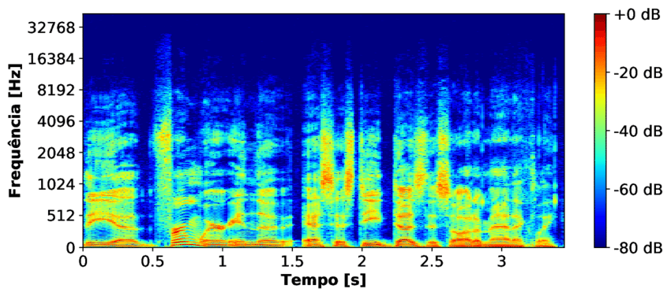

## Enunciado: Visualização de Áudio com Espectrograma de Mel

Crie um programa em Python que converta um arquivo de áudio para uma representação visual chamada **espectrograma de Mel**. Esta técnica é comumente usada em processamento de sinais de áudio e aprendizado de máquina para extrair características relevantes do som, imitando a forma como o ouvido humano percebe o som.

### Contexto Teórico

Um **espectrograma** é uma representação visual do espectro de frequências de um sinal, mostrando como a intensidade ou amplitude de diferentes frequências varia ao longo do tempo. No entanto, o ouvido humano não percebe as frequências de forma linear. Em vez disso, a percepção auditiva é mais sensível a mudanças em frequências mais baixas e menos sensível em frequências mais altas.

Para replicar essa percepção, o **espectrograma de Mel** usa a **escala de Mel**. Esta é uma escala perceptual de tons em que distâncias iguais na escala Mel são percebidas como distâncias iguais em tom pelo ouvinte. A fórmula de conversão de frequência linear ($f$) para a escala de Mel ($m$) é:

$m = 2595 \cdot \log_{10}(1 + \frac{f}{700})$

Seu programa irá gerar um espectrograma de Mel a partir de um arquivo de áudio, que será salvo como uma imagem.

### Requisitos do Exercício

1.  **Bibliotecas:** Você precisará das seguintes bibliotecas:
    * `librosa`: A biblioteca padrão para análise de áudio em Python. Ela é essencial para carregar o áudio e gerar o espectrograma de Mel.
    * `matplotlib`: Para visualizar e salvar o espectrograma como uma imagem.
    * `numpy`: Para manipulação de dados numéricos, se necessário.

2.  **Carregamento do Áudio:**
    * Crie um programa que carregue um arquivo de áudio de sua escolha (por exemplo, um arquivo `.wav` ou `.mp3`). Se você não tiver um, pode criar um arquivo de áudio simples usando o `scipy.io.wavfile` ou baixar um de repositórios online.
    * O `librosa` possui a função `librosa.load()` que facilita o carregamento e o pré-processamento do áudio. Ela retorna a série temporal do áudio (`y`) e a taxa de amostragem (`sr`).

3.  **Geração do Espectrograma de Mel:**
    * Utilize a função `librosa.feature.melspectrogram()` para gerar o espectrograma de Mel a partir dos dados de áudio carregados (`y`) e da taxa de amostragem (`sr`).
    * Esta função retornará uma matriz de dados que representa o espectrograma.

4.  **Visualização e Salvamento da Imagem:**
    * Use `matplotlib.pyplot` para visualizar a matriz do espectrograma.
    * É altamente recomendado usar `librosa.display.specshow()` para plotar o espectrograma, pois ela já formata os eixos com unidades de tempo e frequência de forma apropriada.
    * Adicione rótulos aos eixos (Tempo e Frequência), um título para o gráfico e uma barra de cores (colormap) para indicar a intensidade das frequências.
    * Salve o gráfico como um arquivo de imagem (por exemplo, `.png`) no diretório do projeto.

### Desafios Adicionais (Opcional)

* **Entrada de Linha de Comando:** Modifique o programa para aceitar o caminho do arquivo de áudio como um argumento da linha de comando, em vez de codificá-lo no script.
* **Ajuste de Parâmetros:** Explore diferentes parâmetros da função `librosa.feature.melspectrogram()`, como `n_fft` (tamanho da janela de Fourier), `hop_length` (passo entre as janelas), e `n_mels` (número de bandas de Mel). Observe como essas mudanças afetam a visualização do espectrograma.
* **Normalização:** Implemente a normalização do espectrograma antes de salvá-lo, para que a imagem final tenha um contraste mais consistente, independentemente do volume do áudio original.
* **Múltiplos Arquivos:** Crie uma função que processe e salve os espectrogramas de todos os arquivos de áudio em uma determinada pasta.